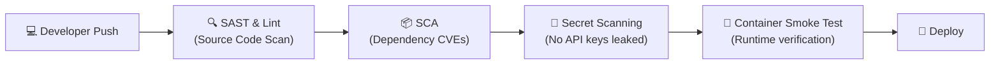

# Module 1 – DevSecOps (30 min)

## 🎯 Learning objectives

- Contrast traditional development, DevOps, and DevSecOps.
- Understand the **Shift Left** principle: why catching security flaws early saves time and money.
- Master the automated security assembly line: SAST, SCA, Secret Scanning, and Container Smoke Testing.
- Walk through a live GitHub Actions CI pipeline with automated security gates.

---

## 🟢 Everyone – What is DevSecOps?

### The car assembly line analogy

Imagine building cars in an assembly plant:

- **Traditional (Waterfall):** Workers assemble thousands of cars. Only when they sit in the parking lot does an inspector check the brakes. If the brakes fail, every single car is recalled, disassembled, and rebuilt at massive cost.
- **DevOps:** The factory automates the line to ship cars every 30 seconds. Speed is high, but without automated safety checks, defects ship just as fast.
- **DevSecOps:** Automated safety sensors are installed on **every robotic arm**. The brake bolt is tested the moment it is tightened. If a defect is found, the line pauses immediately before the car ever rolls off.

```
TRADITIONAL: [ Code ] ──> [ Build ] ──> [ Ship ] ──> ⚠️ [ Security Audit (Weeks later) ]
                                                            └─► Too late, expensive!

 DEVSECOPS:  [ Code ] ──► [ Build ] ──► [ Ship ] ──► 🚀 [ Production ]
                 ▲            ▲            ▲
              (SAST)        (SCA)     (Containers)
              (Lint)      (Secrets)     (Smoke)
                 └────────────┴────────────┴─► Automated Security Gates (Minutes!)
```

### The "Shift Left" economics

The earlier in the software development lifecycle you catch a flaw, the cheaper and safer it is to fix:

| When Found | Effort to Fix | Impact |
|---|---|---|
| **In IDE / Pre-commit** | 2 minutes | Developer fixes typo or flaw before saving |
| **In CI / Pull Request** | 10 minutes | Automated pipeline fails; fixed before merge |
| **In Staging** | 2 hours | Delays deployment, requires ticket tracking |
| **In Production** | Days to weeks | Data breach, downtime, brand damage, regulatory fines |

> **DevSecOps means Security as Code:** Security is not a bottleneck team blocking releases, but automated guardrails empowering developers to deploy safely every day.

---

## 🟡 Curious – The 4 Core DevSecOps Pipeline Gates



### 1. SAST (Static Application Security Testing)
Analyzes source code *without executing it*.
- Catches SQL injection patterns, dangerous functions, unhandled exceptions, and bad cryptography.
- **Tools:** Ruff (Python with Bandit rules), Semgrep, SonarQube, ESLint Security.

### 2. SCA (Software Composition Analysis)
Modern applications are 80-90% third-party open-source packages. SCA checks your dependencies against public CVE databases.
- Alerts you when a library has a remote code execution or denial-of-service flaw.
- **Tools:** `pip-audit` (Python), `npm audit` (Node.js), Dependabot, Snyk.

### 3. Secret Scanning
Scans git commits and history for high-entropy strings, AWS keys, tokens, and passwords.
- **Rule of thumb:** Once a secret is pushed to public Git, assume it is compromised within 60 seconds.
- **Tools:** Gitleaks, Trufflehog, GitHub Secret Scanning.

### 4. Container Scanning & Smoke Testing
Validates container images run as non-root users, have minimal attack surfaces, and pass live `/health` smoke tests before deployment.

---

## 🔴 Techy – Tour of our Real CI Pipeline

In this repository, look at [`.github/workflows/ci.yml`](../../.github/workflows/ci.yml):

```yaml
jobs:
  test:
    name: Lint & Test
    runs-on: ubuntu-latest
    steps:
      - uses: actions/checkout@v4
      - uses: actions/setup-python@v5
        with:
          python-version: "3.13"
          cache: pip
      - run: pip install -r requirements-dev.txt

      # 1. SAST & Style Gate
      - name: Lint (style + security rules)
        run: ruff check .

      # 2. Automated Testing
      - name: Unit tests
        run: pytest -v

      # 3. SCA Gate (Third-party CVEs)
      - name: Dependency vulnerability audit
        run: pip-audit -r requirements.txt

  security:
    name: Secret & vulnerability scans
    runs-on: ubuntu-latest
    steps:
      - uses: actions/checkout@v4
        with:
          fetch-depth: 0
      # 4. Secret Detection Gate
      - uses: gitleaks/gitleaks-action@v2
        env:
          GITHUB_TOKEN: ${{ secrets.GITHUB_TOKEN }}

  docker:
    name: Docker build & smoke test
    runs-on: ubuntu-latest
    needs: test
    steps:
      # 5. Container verification
      - uses: actions/checkout@v4
      - name: Build image
        run: docker build -t todo-api:ci .
      - name: Run container and hit /health
        run: |
          docker run -d --name todo -p 8000:8000 -e API_KEY=ci-only-key-123 todo-api:ci
          curl -fs http://localhost:8000/health
```

Every pull request must pass all these gates before code can merge into `main`!

---

## 💡 Quick check & discussion

1. Why is fixing a security bug in your IDE 100x cheaper than in production? (Zero customer impact, no downtime, fixed in seconds)
2. What is the difference between SAST and SCA? (SAST scans code you wrote; SCA scans third-party packages you imported)
