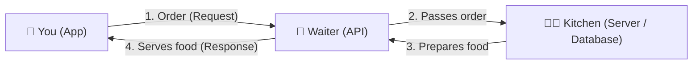

# Module 1 – What is an API? (25 min)

## 🎯 Learning objectives
- Explain an API with an everyday analogy
- Know the four basic actions (get, create, update, delete)
- Recognise a request, a response and JSON

---

## 🟢 Everyone – The restaurant analogy

You're in a restaurant. You don't walk into the kitchen to cook. You:

1. Look at the **menu** (what's available)
2. Tell the **waiter** your order
3. The waiter takes it to the **kitchen**
4. The waiter brings back your **food** (or says "sorry, we're out of that")



| Restaurant | API world |
|---|---|
| You | The app on your phone (the **client**) |
| Menu | API **documentation** – the list of things you can ask for |
| Waiter | The **API** |
| Kitchen | The **server** and **database** |
| Your order | A **request** |
| Your food | A **response** |

> **API = Application Programming Interface** – a set of rules that lets one piece of software ask another piece of software for something.

**Key idea:** you don't need to know *how* the kitchen works. You only need the menu. That's why APIs are powerful – they hide complexity.

### 🗣️ Other analogies that work
- **Electrical socket** – any device with the right plug works; you don't care how the power plant works.
- **ATM** – you press buttons (request), the bank checks things behind the scenes, cash comes out (response).
- **Drive-thru window** – fixed set of options, fast, standard process.

---

## 🟡 Curious – How the order is written

### The four everyday actions ("CRUD")

| Everyday words | HTTP method | Example |
|---|---|---|
| **Show me** | `GET` | Show me my bank balance |
| **Add** | `POST` | Post a new photo |
| **Change** | `PATCH` / `PUT` | Update my delivery address |
| **Remove** | `DELETE` | Delete a comment |

### Address = URL ("endpoint")
```
https://api.weather.example/forecast?city=Manila
└─────────── where ──────────┘└ what ┘└ details ┘
```

### The answer comes in JSON – a simple labelled list
```json
{
  "city": "Manila",
  "temperature_c": 31,
  "condition": "Sunny"
}
```

### Status codes – the waiter's mood 😀😐😟
| Code | Meaning | Restaurant version |
|---|---|---|
| `200 OK` | Here you go | Food served |
| `201 Created` | Done, it's new | Your reservation is made |
| `400/422` | I don't understand your order | "We don't have pizza with ice cream" |
| `401 Unauthorized` | Who are you? | Members-only lounge |
| `404 Not Found` | That doesn't exist | Dish not on the menu |
| `429 Too Many Requests` | Slow down! | Kitchen is overwhelmed |
| `500 Server Error` | Something broke on our side | Kitchen fire 🔥 |

---

## 🔴 Techy – Anatomy of an HTTP request

```http
POST /todos HTTP/1.1
Host: 127.0.0.1:8000
Content-Type: application/json
X-API-Key: ********

{"title": "Buy milk"}
```

```http
HTTP/1.1 201 Created
Content-Type: application/json

{"id": 1, "title": "Buy milk", "done": false, "created_at": "2026-10-05T12:00:00Z"}
```

- **REST** – style of API built on URLs + HTTP methods (what we use today)
- Others you'll hear about: **GraphQL** (client asks for exactly the fields it wants), **gRPC** (fast, binary, service-to-service), **Webhooks** (the API calls *you* when something happens)

---

## 🧪 Live demo (5 min)
Open these in a browser – each one is an API call, and the response is JSON:

- https://api.github.com/users/octocat
- https://catfact.ninja/fact
- https://api.open-meteo.com/v1/forecast?latitude=14.6&longitude=121&current_weather=true

Ask: *"What did we send? What came back? Could an app use this?"*

## ❓ Quick check
1. In the restaurant analogy, who is the API? *(The waiter)*
2. Which HTTP method would "show me my orders" use? *(GET)*
3. What does `404` mean? *(Not found)*
