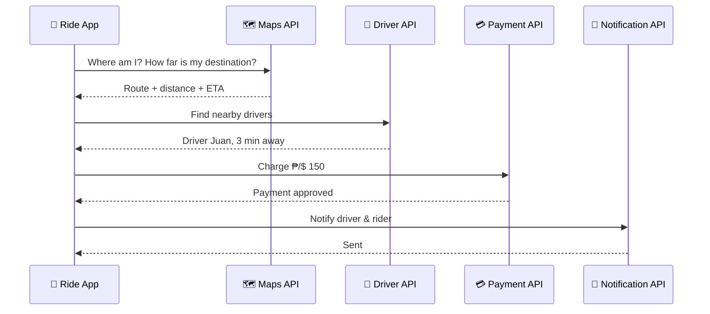

# Module 2 – APIs in Daily Life (20 min)

## 🎯 Learning objectives
- Realise you use dozens of APIs every day without noticing
- See that one app is really many services connected by APIs

---

## 🟢 Everyone – A day full of APIs

| Time | What you do | APIs working behind the scenes |
|---|---|---|
| 7:00 | Check the weather on your phone | Weather app → **weather data API** |
| 7:30 | Book a ride | Ride app → **maps API**, **pricing API**, **driver location API**, **payment API**, **SMS/notification API** |
| 9:00 | "Log in with Google" on a website | Website → **Google sign-in API** (website never sees your password) |
| 12:00 | Order food delivery | App → restaurant **menu API**, **payments**, **live tracking** |
| 13:00 | Pay with QR / e-wallet | Wallet → **bank API** → merchant's bank |
| 15:00 | Share a link on chat – a preview appears | Chat app → website **preview/metadata API** |
| 18:00 | Track your parcel | Shop → **courier tracking API** |
| 20:00 | Stream a movie, it recommends another | Streaming app → **recommendation API** |
| 22:00 | Ask a voice assistant / AI chatbot | App → **speech + AI model APIs** |

### Case study: what happens when you book a ride 🚗

**Key idea:** the ride company didn't build maps, payments or SMS from scratch. It **plugged in** other companies' APIs, like LEGO bricks. 🧱

---

## 🟡 Curious – Kinds of APIs

| Type | Who can use it | Example |
|---|---|---|
| **Public / Open** | Anyone (sometimes with a free key) | Weather, open government data |
| **Partner** | Approved business partners | Banks sharing data with a fintech app |
| **Private / Internal** | Only the company's own apps | A company's mobile app talking to its own servers |

---

## 🔴 Techy – See it yourself
1. Open any website → press **F12** → **Network** tab → filter **Fetch/XHR**.
2. Refresh the page. Every line is an API call! Click one to see the request, headers and JSON response.
3. Try it on a news site, a shop or a map page.

---

## 👥 Group activity (10 min) – "Unbox an app"
In groups of 3–5 (mix techy and non-tech people!):

1. Pick an app everyone knows (food delivery, banking, social media, maps…).
2. Draw the app in the middle of a paper.
3. Around it, draw every **outside service** you think it talks to.
4. Present in 1 minute: *"Our app uses at least __ APIs!"*

**Facilitator tip:** award a small prize to the group that finds the most realistic APIs.

## ❓ Quick check
1. Name three APIs you used today.
2. Why doesn't a ride app build its own maps? *(Faster, cheaper, better quality – reuse via APIs)*
3. When you "Log in with Google", does the website get your Google password? *(No – Google's API only confirms who you are)*
