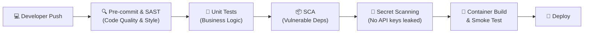

# Module 2 – Introduction to DevSecOps (30 min)

## 🎯 Learning objectives

- Contrast traditional development, DevOps, and DevSecOps.
- Understand the **Shift Left** principle and why early detection is critical.
- Identify the five stages of an automated security pipeline (SAST, SCA, Secrets, Testing, Container scanning).
- Walk through a live GitHub Actions CI workflow with built-in security gates.

---

## 🟢 Everyone – What is DevSecOps?

### The story: The car factory inspection

Imagine building cars in an assembly line:

- **Traditional (Waterfall):** Workers assemble the entire car. Only when thousands are parked at the lot does a single safety inspector check the brakes. If the brakes fail, every car must be recalled, disassembled, and rebuilt at astronomical cost.
- **DevOps:** Workers automate the manufacturing line so cars roll out every 30 seconds. Speed is incredible, but if safety checks aren't automated, defects ship just as fast.
- **DevSecOps:** Safety checks are built directly into **every robotic arm** on the assembly line. The bolt is torqued and tested on the spot. If a part has a defect, the line halts immediately before the car ever rolls off.

```
       TRADITIONAL: [ Code ] ──> [ Build ] ──> [ Ship ] ──> ⚠️ [ Security Audit (Weeks later) ]
                                                                   └─► Too late, expensive!

        DEVSECOPS:  [ Code ] ──► [ Build ] ──► [ Ship ] ──► 🚀 [ Production ]
                        ▲            ▲            ▲
                     (SAST)        (SCA)     (Containers)
                     (Lint)      (Secrets)     (Smoke)
                        └────────────┴────────────┴─► Automated Security Gates (Minutes!)
```

### The "Shift Left" philosophy

The earlier in the development lifecycle you detect a bug or vulnerability, the cheaper and faster it is to fix:

| When found | Effort to fix | Real-world impact |
|---|---|---|
| **In the IDE / Pre-commit** | 2 minutes | Fix typo or misconfiguration before saving |
| **In CI (Pull Request)** | 10 minutes | Pipeline fails, developer updates code before merge |
| **In Staging / Pre-prod** | 2 hours | Tickets created, deployment delayed |
| **In Production** | Days to weeks | Data breach, brand damage, emergency hotfixes, regulatory fines |

> **DevSecOps means "Security as Code"** — security is not a gatekeeper team saying "no" at the end of the sprint, but an automated safety net empowering developers to ship safely every day.

---

## 🟡 Curious – The Automated DevSecOps Pipeline

An automated security assembly line incorporates 5 complementary layers of protection:



### 1. Pre-commit & IDE Linters
Catch syntax flaws and insecure patterns (e.g. `eval()`, hardcoded paths) as you type.

### 2. SAST (Static Application Security Testing)
Analyzes the source code *without running it*.
- Scans for SQL injection patterns, dangerous functions, unhandled exceptions, and bad cryptography.
- **Tools:** Ruff (Python with Bandit rules), Semgrep, SonarQube, ESLint Security.

### 3. SCA (Software Composition Analysis)
Modern applications are 80-90% open-source third-party libraries. SCA checks your dependencies against public CVE (Common Vulnerabilities and Exposures) databases.
- Alerts you when a library has a known remote code execution or denial-of-service flaw.
- **Tools:** `pip-audit` (Python), `npm audit` (JavaScript/TypeScript), Snyk, Dependabot.

### 4. Secret Scanning
Scans git commits, diffs, and history for high-entropy strings, AWS keys, passwords, and tokens.
- **Rule of thumb:** Once a secret is pushed to a public git repo, assume it is compromised within 60 seconds.
- **Tools:** Gitleaks, Trufflehog, GitHub Secret Scanning.

### 5. Container & DAST Scanning
Validates that container images (Docker) run with non-root users, minimal attack surfaces (Alpine / slim bases), and passes live smoke tests before reaching production.

---

## 🔴 Techy – Tour of our Real CI Pipeline

In this repository, look at [`.github/workflows/ci.yml`](../../.github/workflows/ci.yml):

```yaml
jobs:
  test:
    name: Lint & Test
    runs-on: ubuntu-latest
    steps:
      - uses: actions/checkout@v4
      - uses: actions/setup-python@v5
        with:
          python-version: "3.13"
          cache: pip
      - run: pip install -r requirements-dev.txt

      # 1. SAST & Style Gate
      - name: Lint (style + security rules)
        run: ruff check .

      # 2. Automated Testing
      - name: Unit tests
        run: pytest -v

      # 3. SCA Gate (Third-party CVEs)
      - name: Dependency vulnerability audit
        run: pip-audit -r requirements.txt

  security:
    name: Secret & vulnerability scans
    runs-on: ubuntu-latest
    steps:
      - uses: actions/checkout@v4
        with:
          fetch-depth: 0
      # 4. Secret Detection Gate
      - uses: gitleaks/gitleaks-action@v2
        env:
          GITHUB_TOKEN: ${{ secrets.GITHUB_TOKEN }}

  docker:
    name: Docker build & smoke test
    runs-on: ubuntu-latest
    needs: test
    steps:
      # 5. Container verification
      - uses: actions/checkout@v4
      - name: Build image
        run: docker build -t todo-api:ci .
      - name: Run container and hit /health
        run: |
          docker run -d --name todo -p 8000:8000 -e API_KEY=ci-only-key-123 todo-api:ci
          # Loop until healthy
          curl -fs http://localhost:8000/health
```

Every single pull request must pass all these checks before anyone can merge into `main`!

---

## 💡 Quick check & discussion

1. If an open-source library you use has a critical security flaw discovered tomorrow, which tool warns you? (**SCA** – e.g. `pip-audit` / Dependabot)
2. What is the difference between SAST and DAST? (SAST analyzes source code at rest; DAST probes a running application from the outside)
