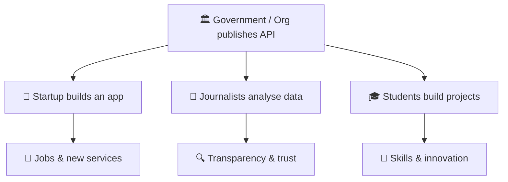

# Module 3 – APIs for Community, Society & Economy (20 min)

## 🎯 Learning objectives
- Explain how APIs create value beyond a single app
- Give examples of APIs helping communities, governments and businesses
- Understand the idea of the "API economy" – and its risks

---

## 🟢 Everyone – Why sharing through APIs matters

> **Analogy: public roads 🛣️** – A government builds roads once. Then thousands of businesses (delivery, buses, shops) use them to create value nobody planned. APIs are **digital roads**: build once, and others build on top.

### 1. 🏘️ Community
| Example | How APIs help |
|---|---|
| **Disaster alerts** | Weather & earthquake agencies publish APIs → apps, radios and SMS services send early warnings automatically |
| **Public transport apps** | Transit operators share schedules & live positions → anyone can build a "when's my bus?" app |
| **Local volunteers / NGOs** | Free map APIs (e.g. OpenStreetMap) help map flood zones and relief centres |
| **Health** | Clinics share appointment availability → one booking app for a whole city |

### 2. 🏛️ Society & government
| Example | How APIs help |
|---|---|
| **Open data portals** | Budgets, air quality, traffic published as APIs → journalists and citizens can check the facts (transparency) |
| **Digital ID & e-services** | One verified identity reused across agencies → less paperwork, fewer queues |
| **Inclusion** | Translation & speech APIs make services usable in local languages and by people with disabilities |

### 3. 💰 Economy
| Example | How APIs help |
|---|---|
| **Small businesses** | A small shop adds online payments, delivery and invoicing in a day by plugging in APIs |
| **Open banking** | Banks share data (with your permission) → budgeting apps, faster loans, more competition, better deals |
| **Startups & jobs** | New companies are built entirely on combining APIs (maps + payments + messaging) |
| **APIs as products** | Companies earn money selling API access (payments, SMS, AI, weather) – the **API economy** |
| **Remittances & digital payments** | Cheaper, faster cross-border transfers and QR payments between different banks and wallets |

---

## 🟡 Curious – The other side: risks & responsibilities

APIs share data, so they must be handled responsibly:

| Risk | Example | Good practice |
|---|---|---|
| **Privacy** | An app shares more personal data than needed | Collect only what's needed, ask for consent |
| **Security breaches** | A poorly protected API leaks millions of records | Authentication, testing, monitoring (→ Module 5) |
| **Dependency** | An API shuts down and apps break | Have backups / alternatives |
| **Digital divide** | Only people with smartphones benefit | Offer SMS / offline / assisted channels too |

> Data protection laws (e.g. GDPR in Europe and similar privacy laws in many countries) make organisations responsible for how data flows through their APIs.

---

## 🔴 Techy – What makes an API "good for society"
- **Open standards** (REST, OpenAPI spec, JSON) → anyone can use it
- **Clear documentation & free tier** → low barrier for students and startups
- **Versioning** (`/v1/`, `/v2/`) → apps don't suddenly break
- **Consent & scopes** (OAuth2) → users decide what is shared
- **Rate limits & fair use** → one user can't hog the service

---

## 💬 Discussion (8 min)
Pick one and discuss in pairs, then share with the room:
1. *"If our city published one API tomorrow, what should it be – and who would benefit?"*
2. *"What data would you **not** want shared through an API? Why?"*
3. *"Think of a small business you know. Which API could save them time or money?"*

## ❓ Quick check
1. What's the "digital roads" analogy? *(APIs are built once and let many others build on top)*
2. Name one way APIs help small businesses. *(Payments, delivery, invoicing without building from scratch)*
3. Name one risk of sharing data via APIs. *(Privacy, breaches, dependency, digital divide)*
