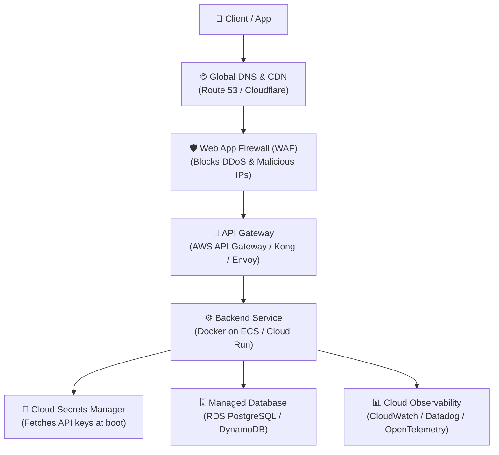

# Module 3 – Cloud Integration (45 min)

## 🎯 Learning objectives

- Contrast running on a developer laptop with modern **Cloud-Native** architectures.
- Understand the role and responsibilities of an **API Gateway**.
- Apply **Cloud IAM & Workload Identity** following least-privilege principles.
- Manage sensitive configurations with **Cloud Secrets Managers**.
- Compare containerized (ECS/Cloud Run) and serverless (Lambda) deployment models.
- Set up automated health monitoring and cloud observability.

---

## 🟢 Everyone – Moving from Laptop to Cloud

### The "It works on my machine" problem

When running an API locally:
- If the computer goes to sleep, the API dies.
- If Wi-Fi drops, nobody can reach the app.
- If 10,000 customers visit at once, the system crashes.
- If storage fails, all data is permanently lost.

The **Cloud** is not magic—it is an automated fleet of reliable, globally distributed data centers managed by providers like AWS, Google Cloud, and Microsoft Azure.

Moving to the cloud gives our API:
1. **High Availability (99.99% uptime):** If one server fails, another takes over in milliseconds.
2. **Auto-scaling:** Scales up compute power during traffic spikes and scales down when idle to minimize costs.
3. **Global Edge Reach:** Routes requests to data centers closest to end users.

---

## 🟡 Curious – The Modern Cloud-Native API Stack

In modern production systems, you almost never expose your backend directly to the internet. Traffic flows through a multi-tier cloud architecture:



### 1. The API Gateway: The Perimeter Guard

Instead of each backend service managing its own SSL certificates and rate limits, the **API Gateway** handles cross-cutting concerns at the edge:
- **TLS/SSL Termination:** Encrypts external traffic with HTTPS before reaching backends.
- **Path-Based Routing:** Directs `/todos` to the Todo service, `/auth` to the Identity service.
- **Edge Rate Limiting & Quotas:** Drops bot floods before they reach backend servers.
- **Auth Offloading:** Validates JWT tokens and API keys at the perimeter.

### 2. Cloud IAM & Workload Identity: Zero Hardcoded Keys

In traditional systems, developers generated static AWS access keys and saved them in `.env` files. If those keys leaked, the entire cloud account was compromised.

**Cloud Best Practice: Workload Identity (IAM Roles)**
- Your application running inside the cloud assumes an **IAM Role** attached to its container.
- The cloud provider automatically injects **short-lived temporary credentials** (valid for minutes) into the container environment.
- **Principle of Least Privilege:** Grant only the exact permissions needed (e.g., read-only access to one specific database table).

### 3. Cloud Secrets Management

Never bake passwords or secret keys into Docker container images or Git repositories.

- Store sensitive variables (database credentials, third-party payment keys) in **AWS Secrets Manager**, **Google Secret Manager**, or **HashiCorp Vault**.
- The cloud platform injects these secrets securely into your container's environment variables at startup.
- Supports **automatic secret rotation** without requiring code changes.

### 4. Deployment Models: Containers vs. Serverless

| Model | How It Works | Best Suited For |
|---|---|---|
| **Managed Containers**<br/>(AWS ECS / Google Cloud Run / K8s) | Packages app and dependencies into a Docker container. Runs 24/7 or auto-scales on CPU/memory. | High-traffic APIs, long-running processes, predictable workloads. |
| **Serverless Functions**<br/>(AWS Lambda / Azure Functions) | Cloud executes code only when a request arrives, then terminates. Pay strictly per millisecond. | Variable or unpredictable traffic, event-driven webhooks, scheduled tasks. |

---

## 🔴 Techy – Cloud Container Hardening Walkthrough

Take a look at our project's production [`demo/Dockerfile`](../../demo/Dockerfile). Notice how each line follows cloud security best practices:

```dockerfile
# 1. Minimal base image to reduce attack surface and CVEs
FROM python:3.13-slim

WORKDIR /app

# 2. Dependency caching in isolated layers
COPY requirements.txt .
RUN pip install --no-cache-dir -r requirements.txt

# 3. Create non-root user (Rule: never run containers as root!)
RUN groupadd -r appuser && useradd -r -g appuser -d /app appuser

# 4. Copy code and set ownership
COPY app/ app/
RUN chown -R appuser:appuser /app

# 5. Switch to non-root user
USER appuser

# 6. Built-in Cloud Healthcheck
HEALTHCHECK --interval=30s --timeout=5s --retries=3 \
  CMD curl -f http://localhost:8000/health || exit 1

EXPOSE 8000
CMD ["uvicorn", "app.main:app", "--host", "0.0.0.0", "--port", "8000"]
```

### The 3 Pillars of Cloud Observability

1. **Metrics:** Real-time health gauges (Requests per second, P95 latency in milliseconds, Error rate %).
2. **Logs:** Structured JSON logs sent to a central aggregator (CloudWatch, Datadog).
3. **Traces:** Distributed tracing (OpenTelemetry / AWS X-Ray) that follows a single request across the API Gateway, backends, and databases.

---

## 📋 Cloud Readiness Checklist

- [ ] Container runs as a **non-root** user.
- [ ] No hardcoded secrets or credentials in source code or Docker images.
- [ ] Sensitive environment variables injected via Cloud Secrets Manager.
- [ ] Health probe endpoint (`/health`) configured for load balancers.
- [ ] API Gateway enforces TLS 1.3, routing, and rate limits.
- [ ] IAM roles follow least privilege with temporary token rotation.
- [ ] Alerting set up for elevated 5xx error rates (> 1%) and high latency (> 500ms).
