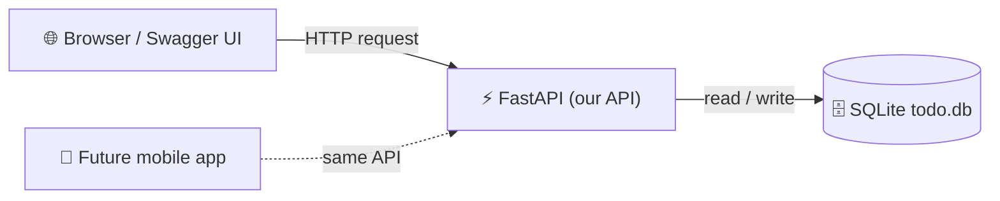

# Module 4 – Let's Build an API: the Todo Demo (40 min)

## 🎯 Learning objectives
- See a real API built in about 100 lines of Python
- Use an API from the browser through **Swagger UI** – no coding required
- Connect the demo back to the restaurant analogy

> **Facilitator:** have the app already running before the session (see the [facilitator guide](../facilitator-guide.md#-setup-checklist)). Non-tech participants just watch the browser; techies can code along with [demo/README.md](../../demo/README.md).

---

## 🟢 Everyone – What we're building

A **to-do list API**. No buttons or pretty screens – just the "waiter" that any app (phone, website, smartwatch) could talk to.



| Restaurant | Our demo |
|---|---|
| Menu | Swagger UI at `/docs` |
| Waiter | FastAPI (`app/main.py`) |
| Kitchen | SQLite database file `todo.db` |
| Recipe rules ("no empty plates") | Validation in `app/models.py` |
| Members-only orders | API key in `app/security.py` |

### Tools in plain words
- **Python** – a popular, readable programming language
- **FastAPI** – a Python toolkit for building APIs quickly; creates the menu (docs) automatically
- **SQLite** – a tiny database stored in one file, no installation needed

---

## 🟡 Curious – Live walkthrough in Swagger UI (click-by-click)

Open **http://127.0.0.1:8000/docs**.

| Step | Click | What to say |
|---|---|---|
| 1 | `GET /health` → **Try it out** → **Execute** | "Is the waiter awake? `200` + `{"status": "ok"}` means yes." |
| 2 | `GET /todos` → Execute | "Empty list `[]` – the kitchen has no orders yet." |
| 3 | `POST /todos` with `{"title": "Buy milk"}` → Execute | "**401!** Members only – we didn't show our key. (Teaser for Module 5)" |
| 4 | Click **Authorize 🔒** (top right), paste the key from `.env` | "Now we've shown our membership card." |
| 5 | `POST /todos` again | "`201 Created` – it got an `id` and a timestamp." |
| 6 | Add 2–3 more todos (ask the audience for ideas!) | Fun moment – audience participation |
| 7 | `GET /todos` | "Our todos, as JSON." |
| 8 | `PATCH /todos/1` with `{"done": true}` | "Change an order." |
| 9 | `GET /todos?done=true` | "Filter – only finished items." |
| 10 | `DELETE /todos/2` → then `GET /todos/2` | "`204` deleted, then `404` not found." |
| 11 | `POST /todos` with `{"title": ""}` | "`422` – the API refuses bad data." |
| 12 | Stop and restart the server, `GET /todos` | "Data is still there – it's saved in the database file." |

---

## 🔴 Techy – Code tour

### Project layout
```
demo/app/
├── main.py       # endpoints
├── models.py     # data shapes + validation
├── database.py   # SQLite connection
├── security.py   # API key, rate limit, headers
└── config.py     # settings from environment variables
```

### 1. Define the data ([models.py](../../demo/app/models.py))
```python
class TodoBase(SQLModel):
    title: str = Field(min_length=1, max_length=200)
    done: bool = False

class Todo(TodoBase, table=True):          # the database table
    id: int | None = Field(default=None, primary_key=True)
    created_at: datetime = Field(default_factory=_now)

class TodoCreate(TodoBase):                 # what clients may send
    model_config = ConfigDict(extra="forbid", str_strip_whitespace=True)
```

### 2. Connect to the database ([database.py](../../demo/app/database.py))
```python
engine = create_engine("sqlite:///./todo.db", connect_args={"check_same_thread": False})

def get_session():
    with Session(engine) as session:
        yield session
```

### 3. Write an endpoint ([main.py](../../demo/app/main.py))
```python
@app.post("/todos", response_model=TodoRead, status_code=201,
          dependencies=[Depends(require_api_key)])
def create_todo(payload: TodoCreate, session: Session = Depends(get_session)):
    todo = Todo.model_validate(payload)
    session.add(todo)
    session.commit()
    session.refresh(todo)
    return todo
```

What FastAPI gives us for free:
- **Validation** – bad JSON → automatic `422` with a helpful message
- **Docs** – Swagger UI at `/docs` and ReDoc at `/redoc`, from the type hints
- **Dependency injection** – `Depends(...)` plugs in the DB session and security checks

### 4. Test it ([tests/test_todos.py](../../demo/tests/test_todos.py))
```python
def test_write_without_api_key_is_rejected(client):
    assert client.post("/todos", json={"title": "Hack"}).status_code == 401
```
Run `pytest -v` – 15 tests check CRUD, security and errors in under a second.

### 💪 Code-along challenges (if time allows)
1. Add a `priority` field (`low` / `medium` / `high`) – hint: `Literal["low","medium","high"]`.
2. Add a `GET /todos/stats` endpoint returning `{"total": n, "done": n}`.
3. Write a test for your new endpoint.

## ❓ Quick check
1. Where do we see the API's "menu"? *(Swagger UI at `/docs`)*
2. Why did the first `POST` fail? *(No API key → 401)*
3. Why is the data still there after restarting? *(It's saved in the SQLite file)*
