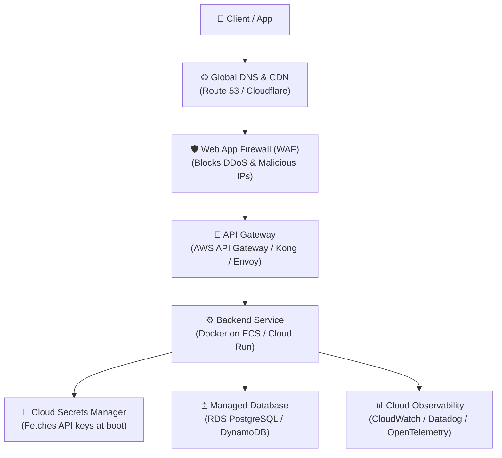

# Module 4 – Cloud Integration (45 min)

## 🎯 Learning objectives

- Contrast running on a local machine with modern **Cloud-Native** architectures.
- Understand the role and responsibilities of an **API Gateway**.
- Apply **Cloud IAM & Workload Identity** following least-privilege principles.
- Manage sensitive configurations with **Cloud Secrets Managers**.
- Compare containerized (ECS/Kubernetes) and serverless (Lambda/Cloud Run) deployment models.
- Set up automated health monitoring and cloud observability.

---

## 🟢 Everyone – Moving from Laptop to Cloud

### The "It works on my machine" problem

When running an API on your laptop:
- If your laptop goes to sleep, the API dies.
- If your Wi-Fi drops, nobody can reach your app.
- If 10,000 customers visit at once, your computer freezes.
- If your hard drive fails, all data is permanently lost.

The **Cloud** is not magic—it is an automated fleet of reliable, globally distributed data centers managed by providers like AWS, Google Cloud, and Microsoft Azure.

Moving to the cloud gives our API:
1. **High Availability (99.99% uptime):** If one server fails, another takes over in milliseconds.
2. **Auto-scaling:** Spawns more compute power during peak traffic (e.g. Black Friday) and scales down when traffic drops to save cost.
3. **Global Reach:** Serves users from data centers located nearest to them.

---

## 🟡 Curious – The Modern Cloud-Native API Stack

In modern production systems, you almost never expose your backend application directly to the internet. Instead, traffic flows through a multi-tier cloud architecture:



### 1. The API Gateway: The Front Door

Instead of every individual backend handling SSL certificates, rate limits, and custom routing, the **API Gateway** handles cross-cutting concerns at the edge:
- **TLS/SSL Termination:** Encrypts traffic with HTTPS before reaching backends.
- **Path Routing:** Directs `/todos` to the Todo service, `/users` to the Auth service.
- **Edge Rate Limiting & Quotas:** Drops bot floods before they consume backend resources.
- **Auth Offloading:** Validates JWT tokens and API keys at the perimeter.

### 2. Cloud IAM & Workload Identity: Zero Hardcoded Keys

In traditional architectures, developers generated static AWS access keys and saved them in config files. If those keys leaked, the entire cloud account was compromised.

**Cloud Best Practice: Workload Identity (IAM Roles)**
- Your application running inside the cloud assumes an **IAM Role** attached to its instance or container.
- The cloud provider automatically injects **short-lived temporary credentials** (valid for 15 minutes) into the container environment.
- **Principle of Least Privilege:** Grant only the exact permissions needed (e.g., read-only access to one specific S3 bucket).

### 3. Cloud Secrets Management

Never bake passwords or secret keys into Docker container images or Git repositories.

- Store sensitive variables (database passwords, third-party payment keys) in **AWS Secrets Manager**, **Google Secret Manager**, or **HashiCorp Vault**.
- The cloud platform injects these secrets securely into your container's environment variables at startup.
- Supports **automatic secret rotation** every 30 or 90 days without rewriting code.

### 4. Deployment Models: Containers vs. Serverless

| Model | How it works | Best suited for |
|---|---|---|
| **Managed Containers**<br/>(AWS ECS / Google Cloud Run / K8s) | Packages app and dependencies into a Docker container. Stays running 24/7 or scales on CPU. | High-traffic APIs, long-running processes, predictable workloads. |
| **Serverless Functions**<br/>(AWS Lambda / Azure Functions) | Cloud executes code only when a request arrives, then shuts it down. Pay strictly per millisecond. | Variable or unpredictable traffic, event-driven webhooks, scheduled tasks. |

---

## 🔴 Techy – Cloud Container Hardening Walkthrough

Take a look at our project's production [`demo/Dockerfile`](../../demo/Dockerfile). Notice how each line follows cloud security best practices:

```dockerfile
# 1. Minimal base image to reduce attack surface and CVEs
FROM python:3.13-slim

WORKDIR /app

# 2. Dependency caching in isolated layers
COPY requirements.txt .
RUN pip install --no-cache-dir -r requirements.txt

# 3. Create non-root user (Rule: never run containers as root!)
RUN groupadd -r appuser && useradd -r -g appuser -d /app appuser

# 4. Copy code and set ownership
COPY app/ app/
RUN chown -R appuser:appuser /app

# 5. Switch to non-root user
USER appuser

# 6. Built-in Cloud Healthcheck
HEALTHCHECK --interval=30s --timeout=5s --retries=3 \
  CMD curl -f http://localhost:8000/health || exit 1

EXPOSE 8000
CMD ["uvicorn", "app.main:app", "--host", "0.0.0.0", "--port", "8000"]
```

### The 3 Pillars of Cloud Observability

Once your API is in the cloud, you can't use `print()` statements on your local terminal. You need telemetry:

1. **Metrics:** Real-time health gauges (Requests per second, P95 latency in milliseconds, Error rate %).
2. **Logs:** Structured JSON logs sent to a central aggregator (CloudWatch, Elasticsearch).
3. **Traces:** Distributed tracing (OpenTelemetry / AWS X-Ray) that follows a single user request across the API Gateway, backend services, and database queries.

---

## 📋 Cloud Readiness Checklist

Before shipping an API to production in the cloud:
- [ ] Container runs as a **non-root** user.
- [ ] No hardcoded secrets or passwords in source code or Docker images.
- [ ] Sensitive environment variables injected via Cloud Secrets Manager.
- [ ] Health probe endpoint (`/health`) configured for load balancers.
- [ ] API Gateway enforces TLS 1.3 and rate limiting.
- [ ] IAM roles follow least privilege with temporary token rotation.
- [ ] Alerting set up for elevated 5xx error rates (> 1%) and high latency (> 500ms).
