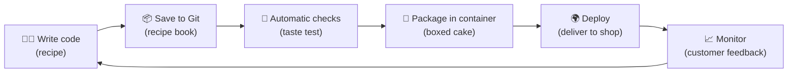
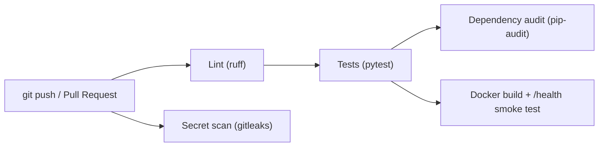

# Module 6 – DevOps Basics (20 min)

## 🎯 Learning objectives
- Explain DevOps with an everyday analogy
- Follow the journey of code from a laptop to the internet
- See a real automated pipeline (CI) and a container (Docker)

---

## 🟢 Everyone – The bakery assembly line 🍞

Imagine a bakery. In the old days, one baker made a cake, then carried it to a separate team who checked it, then to another team who delivered it. Slow, and lots of "it was fine when I baked it!" arguments.

**DevOps** = **Dev**elopers (bakers) + **Op**eration**s** (the people who run the shop) working as **one team**, with an **automated assembly line**:



| Step | Bakery | Software |
|---|---|---|
| **Plan & code** | Write a recipe | Developer writes code |
| **Version control (Git)** | Recipe book with every version saved | Every change saved, can undo anything |
| **CI – Continuous Integration** | A robot taste-tests every new batch | Automatic tests & security checks on every change |
| **Containers (Docker)** | Cake in a sealed box – arrives the same anywhere | App + everything it needs packed together |
| **CD – Continuous Delivery/Deployment** | Conveyor belt to the shop | Approved code goes live automatically |
| **Monitoring** | Customer reviews, sales numbers | Uptime, errors, speed alerts |

**Why should non-techies care?** DevOps is why your banking app gets updates every week *without* going down, and why bugs get fixed in hours instead of months.

---

## 🟡 Curious – Key ideas

- **Git** – a time machine for code. Teams work on separate **branches** (feature, bugfix, hotfix) and merge them via a **Pull Request** where others review the change.
- **Automated tests** – small programs that check the app still works. Our demo has 15 of them; they run in under a second.
- **"Works on my machine" problem** → solved by **containers**: same box everywhere.
- **DevSecOps** – security checks are built *into* the assembly line, not added at the end.
  - 🔍 **Lint / static analysis** – spot risky code patterns
  - 📚 **Dependency audit** – are we using libraries with known holes?
  - 🔑 **Secret scanning** – did someone accidentally commit a password?

> 📖 **True story from building this workshop:** the first time we ran the dependency audit on the demo, it found **7 known vulnerabilities** in an older version of a library (Starlette) we had pinned. The pipeline blocked it, we upgraded, and the audit went green. That's DevSecOps doing its job!

---

## 🧪 Live demo (8 min)

### 1. Run the checks locally (what the robot does)
```powershell
cd demo
pytest -v                       # 15 tests ✅
ruff check .                    # style + security lint ✅
pip-audit -r requirements.txt   # known vulnerable libraries? ✅
```

### 2. Put the app in a container
```powershell
docker build -t todo-api .
docker run -p 8000:8000 -e API_KEY=workshop-secret-123 todo-api
# open http://127.0.0.1:8000/docs – same app, now inside a box
```

### 3. Show the pipeline on GitHub
Open the repo's **Actions** tab and show a run of [ci.yml](../../.github/workflows/ci.yml):


✅ All green = safe to merge. ❌ Any red = the change is blocked until fixed.

---

## 🔴 Techy – What's in the repo

| File | Purpose |
|---|---|
| [.github/workflows/ci.yml](../../.github/workflows/ci.yml) | GitHub Actions pipeline: ruff → pytest → pip-audit, gitleaks, Docker build + smoke test |
| [demo/Dockerfile](../../demo/Dockerfile) | `python:3.13-slim`, deps cached in their own layer, non-root user, `HEALTHCHECK` on `/health`, `/data` volume for SQLite |
| [demo/pyproject.toml](../../demo/pyproject.toml) | Ruff rules incl. `S` (bandit security checks) and pytest config |
| [demo/.env.example](../../demo/.env.example) | Config template – real secrets live in env vars / secret stores |

### Branching model used for this repo
| Branch | Use |
|---|---|
| `main` | Production – never commit directly |
| `develop` | Integration |
| `feature/*` | New features |
| `bugfix/*` | Fixes for tracked issues |
| `hotfix/*` | Urgent production fixes |

### Where to deploy next (pick one)
Any container platform works: Google Cloud Run, AWS App Runner / ECS, Azure Container Apps, Fly.io, Render, Railway. Set `API_KEY` as a **secret** in the platform, and the platform provides HTTPS.

> ⚠️ SQLite is a single file – fine for demos, but for multiple servers use a managed database (e.g. PostgreSQL).

## ❓ Quick check
1. What does CI do? *(Automatically tests and checks every code change)*
2. What problem do containers solve? *("Works on my machine" – same box everywhere)*
3. Name one security check in our pipeline. *(Lint, dependency audit, secret scanning)*
